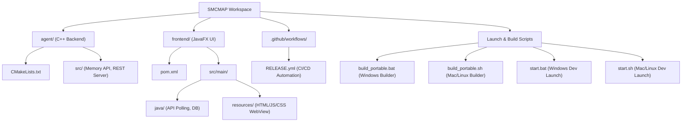

# System Memory & Cache Monitoring and Analysis Platform (SMCMAP)

SMCMAP is a high-performance system monitoring and cache simulation workspace built precisely for academic and demonstration purposes. It intelligently splits processing power utilizing a native **C++ Backend** agent communicating over a lightweight REST API to a customized, reactive **JavaFX Frontend** mimicking modern web-based UI standards.

## Download

You can download the latest standalone portable executable for Windows directly from the [Releases](../../releases) page. *(Linux and macOS binaries coming soon!)*

## Project Architecture

SMCMAP operates seamlessly with a unified, dual-language technology stack:

1. **C++ System Agent (`agent/`)**:
   - Compiles down to an executable utilizing native OS libraries.
   - Leverages `GlobalMemoryStatusEx` & `Process32First` (WinAPI) for real-time memory and process information extraction.
   - Custom-built Cache Simulation Engine supporting multiple strategies (FIFO, LRU, LFU).
   - Bundled with a lightweight, multi-threaded REST HTTP server serving performance metrics in standard JSON.

2. **JavaFX Dashboard (`frontend/`)**:
   - Modern, modular CSS-styled UI heavily inspired by Tailwind/HTML workspace dashboards.
   - Built with Maven, Java 17+, and JavaFX.
   - Continuously accesses the C++ backend every 3 seconds to pull live telemetry.
   - Performs asynchronous parsing of JSON logic using Gson and maps variables securely into the Main UI thread safely using `Platform.runLater()`.
   - In-built history logging via local SQLite database persistence (`sqlite-jdbc`).

## Project Structure



---

## Quick Start Guide

### Prerequisites
Ensure your operating system is equipped with the following tools available in your `PATH` variables before compiling:
- **Java Development Kit (JDK) 17+**
- **Apache Maven (mvn)**
- **CMake (cmake)**
- **A C++ Compiler** (e.g., MSVC, MinGW, or GCC if running under WSL)

### Auto-Build Scripts (Recommended)

You can launch both the C++ agent and the JavaFX GUI concurrently with one command using the included helper scripts.

**On Windows:**
Double-click `start.bat` or run:
```bat
.\start.bat
```

**On Git Bash / macOS / Linux:**
```bash
chmod +x start.sh
./start.sh
```

### Packaging into a Standalone Portable App

To bundle SMCMAP into a completely self-contained `.exe` or executable directory without requiring end-users to have Java or C++ installed, simply execute:

**On Windows:**
```bat
.\build_portable.bat
```

**On macOS / Linux:**
```bash
chmod +x build_portable.sh
./build_portable.sh
```

This will automatically compile both backends and link them into an output directory called `portable_build`.

---

## Manual Compilation Guide

If you wish to build or test the components individually, here are the steps:

### 1. Building the C++ Agent
The agent runs on port `:8080`.
```bash
cd agent
mkdir build && cd build
cmake ..
cmake --build . --config Release

# Run the agent manually:
./Release/smcmap_agent.exe  # Or ./smcmap_agent if on macOS/Linux
```
*Note: Depending on your CMake Generator on Windows, the executable may be placed either in `build/` directly or `build/Release/`. Check the folder if it fails to start automatically.*

### 2. Building the Java Frontend
With the C++ agent successfully running in the background, serve the UI dashboard using Maven:
```bash
cd frontend
mvn clean javafx:run
```

## Features

- **Live Memory Utilization Metrics**: System total, used, and free RAM available mapped securely accurately vs standard Task Manager behavior.
- **Background Persistence**: Historical snapshots gracefully log locally into an initialized `smcmap.db` SQLite file for persistence tracking.
- **Save & Export Engine**: Integrated functionality allowing you to drop down the "Save Stats" utility and seamlessly snapshot the past 3 minutes of RAM telemetry right into beautifully curated JSON, Markdown, or PDF formats locally.
- **Live Process Monitoring Tables**: Real-time identification of actively running services, their memory consumption (RSS), alongside tracked process IDs (PIDs).
- **Cache Hit-Ratio Simulators**: Configurable cache block architecture sizes supporting FIFO, LRU, & LFU policies to simulate efficiency inside CPU-like cache block structures.

## License

This project is licensed under the [MIT License](LICENSE).
